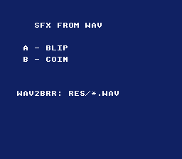

# SFX from WAV



The smallest "press a button, hear a sound" example — and a showcase of the
zero-config **`.wav` → `.brr` build rule**. `res/blip.wav` and `res/coin.wav`
are ordinary PCM WAV files; the build system converts each to a SNES BRR sample
with [`wav2brr`](../../../tools/wav2brr) automatically, exactly the way a `.png`
becomes a `.pic`. No `.brr` is committed — they are generated on demand. Press
**A** for a blip, **B** for a coin.

This is the one-shot / sound-effect counterpart to the SNESMOD examples: for a
jump, a hit, or a UI blip you load a BRR sample directly and trigger it, with no
tracker soundbank involved.

## SNES Concepts

- **BRR samples** — the SNES's ADPCM sample format; the DSP plays BRR, nothing else
- **Direct sample playback** — `audioLoadSample()` uploads a sample to the
  SPC700 once; `audioPlaySample()` triggers it on demand
- **Edge-triggered input** — `padPressed()` fires once per press, so one button
  tap plays one sound
- **Asset pipeline** — a source `.wav` auto-converted at build time, the .brr
  `.incbin`'d and linked (see `data.asm`)

## How the WAV becomes a sample

```
res/blip.wav  --wav2brr-->  res/blip.brr  --.incbin (data.asm)-->  blip_brr[]
```

The `.incbin` in `data.asm` makes `res/blip.brr` a build prerequisite, and
`make/common.mk`'s `%.brr: %.wav` rule generates it. To make a looping sample
(a sustained tone), run `wav2brr --loop START END` by hand and commit the
`.brr` instead. See `docs/tutorials/audio.md` ("One-shot samples from WAV").

## How to Build

```bash
cd examples/audio/sfx_from_wav
make
```

Run `sfx_from_wav.sfc` in any emulator (or `luna run sfx_from_wav.sfc`).

## Modules Used

`console`, `dma`, `audio`, `input`, `background`, `text`
