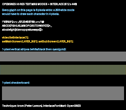

# Hi-res text — BG Mode 5 + interlace (512 × 448)



Port of krom (Peter Lemon)'s **InterlaceFont** demo
([PeterLemon/SNES](https://github.com/PeterLemon/SNES), `PPU/Interlace/InterlaceFont`).
BG Mode 5 renders **512 horizontal pixels** with 16×8 tiles; SETINI bit 0
adds screen interlace for **448 visible lines**. This example lands the
SDK's SETINI surface (`videoSetInterlace/ObjInterlace/Overscan/PseudoHires`,
all composing through a write-only-register shadow) with a text page as
the canonical hi-res payload — every glyph is 8 px wide, unrepresentable
at 256.

The page is original art (`gen_assets.py` renders it and converts to
Mode 5's paired-tile format; outputs committed so builds don't need
Pillow). The 1-pixel stripe/checker bands are the acid test: at true
512 px they alternate every column — a 256-wide mode would alias them
to flat gray.

## SNES Concepts

- BG Mode 5: 512 px, 16×8 tiles stored as 8×8 character pairs (N, N+1)
- SETINI ($2133) via `videoSetInterlace()` — write-only shadow discipline
- **The Mode 5 trap**: content displays through main AND sub screen —
  `setMainScreen(LAYER_BG1); setSubScreen(LAYER_BG1);` or odd columns stay blank
- Interlace vertical addressing: tile texel rows map 1:1 to hi-res lines,
  so a full 448-line page needs 56 tile rows → a 32×64 tilemap

## Understanding what you see

Mode 5's 512 columns interleave the sub screen (even columns) and main
screen (odd columns) — a period CRT blended adjacent columns into smooth
strokes, while a modern LCD's crisp pixel grid shows them individually:

- **Text looks slightly "double-struck"** — those are the real alternating
  columns. Authentic PPU output (hi-res games like Seiken Densetsu 3 show
  the same fringing in emulators); a CRT melts it into clean strokes.
- **The white/black 1-px band reads as flat gray** — 1-px columns are
  finer than typical window scaling can resolve. That IS the acid test:
  at 256 wide this band couldn't exist at all. On a CRT it shimmers.
- **The cyan/gold band still resolves into visible stripes** — its period
  is 4 px (2 px per color), coarse enough to survive scaling: direct
  visual proof you are looking at 512 columns.
- **The 1-px checkerboard reads as gray** — same physics, both axes.

## Register fidelity vs the original

| Register | krom | this port |
|---|---|---|
| BGMODE | `$0D` (Mode 5, priority, 16×8) | same (`setMode(BG_MODE5, 0x08)`) — verified `$0D` in luna |
| SETINI | `$01` | same (`videoSetInterlace(1)`) — verified `$01` |
| TM / TS | `$01` / `$01` | same (`setMainScreen`+`setSubScreen`) — verified |
| BG1SC | map word $4000 | same (`bgSetMapPtr`), 32×64 (krom: 64×32 — his page is wider, ours taller) |
| BG12NBA | tiles word $8000 | same (`bgSetGfxPtr`) — verified |

## Validation notes (luna v1.9.0)

luna renders hi-res/interlace CONTENT correctly but captures at 256×224
(≈2×2 downsample of the 512×448 field pair) — native-resolution capture
is [luna#115](https://github.com/k0b3n4irb/luna/issues/115). The full
448-line page displays once with no vertical wrap (the 32×64 map fix —
a 32-row map only covers 256 hi-res lines in interlace), and the 1-px
bands render as the correct blend grays.

## How to Build

```bash
cd examples/backgrounds/hires_text && make
# regenerate the page (needs Pillow + numpy):
python3 gen_assets.py && make
```

## Modules Used

`console`, `dma`, `background`
