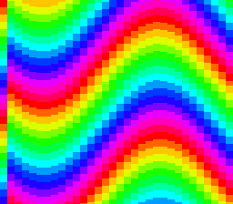

# mode2 — offset-per-tile: per-column scroll from BG3

**Family 2 (Backgrounds) · rung 2.8 — the offset-per-tile modes (2/4/6).**

## Why it matters for your game

Modes 2, 4 and 6 have a trick no other mode offers: **offset-per-tile
(OPT)** lets every 8-pixel *column* of a layer scroll independently. That is
how you get a flag rippling in the wind, a heat-haze shimmer, water
distortion, or cheap per-column parallax — effects that would otherwise cost
a scanline of HDMA or a full software redraw. It is niche, but when you want
it, nothing else does it as cheaply.



## What you'll learn

The single idea: in Mode 2, **BG3 stops being a drawable layer and becomes
an offset table.** For each column of BG1/BG2, the PPU reads a scroll offset
straight out of BG3's tilemap:

- Per screen column *N ≥ 1* (column 0 can't be offset), the PPU reads BG3
  **tile-row 0** for the horizontal offset word and **tile-row 1** for the
  vertical offset word.
- **Offset word:** bit `0x2000` = apply to BG1 (`0x4000` = BG2); the V value
  is bits 0–9, the H value bits 3–9 (8-pixel-granular).

This example puts a stack of horizontal colour bands on BG1 and writes a sine
into BG3's V-offset row, so each column samples the bands at a different
height — the bands ripple. The phase advances each frame. **Modes 4 and 6
reuse this exact data path** (mode 4 packs H/V into one word with a select
bit), so this one example teaches the whole OPT family.

## What to observe / if it breaks

- **Correct run:** rainbow bands ripple as a travelling wave; each column is
  at its own vertical offset, all from one 32-entry BG3 table.
- **Bands stay flat:** the offset table never reached VRAM. The classic cause
  is computing it *after* `WaitForVBlank` — the upload then runs past VBlank
  and the PPU drops it. Build the table during active display, DMA it the
  instant VBlank starts (what this example does).
- **Only the leftmost column is wrong:** column 0 cannot be offset by OPT —
  that is hardware, not a bug.
- **Whole layer shifts uniformly (no ripple):** your offset words are missing
  the `0x2000` enable bit, so the PPU ignores them and uses the base scroll.

Probe oracle: `wave_phase` advances every frame.

## Build & run

```bash
make
../../../tools/luna-test/bin/luna run -n 3000000 mode2.sfc
```

## Modules used

`console`, `dma`, `background`, `math`

## Where you are

← the rest of the family covers the everyday modes
([mode1](../mode1/), [mode0](../mode0/), [mode3](../mode3/),
[mode5](../mode5/)); this rung is the specialist OPT modes. For per-scanline
(rather than per-column) tricks, see the [hdma](../../hdma/) family.
