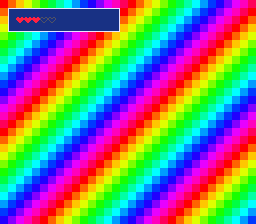

# panel_hud — a HUD that survives a dialog box

**Family 5 (Game math & framework) · a `panel` building block.**

## Why it matters for your game

Every game has furniture: a status bar with hearts and a coin count, a
dialog box that opens over the world and closes again. Both are the same
primitive — a **9-slice panel**, a bordered box stamped from a 3×3 tile
sheet (four corners, four edges, one fill). Without a helper it's ~60
lines of stamping loop and priority wiring per box; the `panel` module is
that loop, done once and correctly, so your game code just says *draw a
box here*.



## What you'll learn

The single new idea: **the `panel` module — several boxes, one layer, one
upload.** The HUD and the dialog live in the *same* tilemap on the *same*
BG layer. `panelDraw()` stamps a box (picking corner/edge/fill by
position); `panelPut()` drops a single sheet tile — a heart icon — into
it; `panelFlush()` uploads the whole map. Opening the dialog is
`panelDraw` + `panelFlush`; closing it is `panelClear` + `panelFlush`; and
the HUD is untouched either way.

Two things worth internalising:

- **You own the tilemap.** `panelInit()` takes your 32×32 buffer rather
  than allocating 2 KB behind your back — a quarter of the 8 KB C RAM band
  — so the cost stays visible. `panelInit()` fills it with entry 0, so
  **tile 0 must be transparent** (here the colourful BG1 shows through it).
- **`panelFlush()` is forced-blank — use it for *structure*, not the HUD.**
  It pushes the whole 2 KB map, so it wraps the DMA in real forced blank
  (`setScreenOff`/`setScreenOn`) and briefly blanks the screen. That is fine
  for a dialog box opening (a deliberate moment), but running it every time a
  heart changes would blink the top of the screen on every hit. So the
  hearts — which change often — upload only their own 64-byte tilemap row
  with an ordinary VBlank DMA (`flush_hud_row`): no forced blank, no flicker.
  **The rule: `panelFlush` for structural changes, a small VBlank DMA for a
  frequently-updated HUD.**

The border and heart icons are generated in C — zero assets.

## What to observe / if it breaks

- **Correct run:** a HUD box with 3 filled + 2 empty hearts sits over a
  rainbow background. **B** loses a heart, **A** gains one, **START**
  opens/closes a dialog box lower down — and the HUD never flinches when
  the dialog appears.
- **Corners/edges tiled everywhere instead of one box:** tile 0 isn't
  transparent, so `panelInit`'s blank entry is drawing a real tile. Keep
  the 9-slice at `base_tile ≥ 1` and leave tile 0 empty.
- **The box is opaque black / hides the background:** the fill palette
  entry, not transparency — only pixel value 0 is transparent; the fill
  uses a real colour on purpose.
- **Top of the screen blinks dark when hearts change:** you're calling
  `panelFlush()` for the HUD. Its forced blank overruns into the first
  scanlines. Push just the changed row with a small VBlank DMA instead
  (`flush_hud_row`); keep `panelFlush` for the dialog.

Probe oracles: `hero_hp` (0–5, hearts shown) and `dialog_shown` (0/1).

## Build & run

```bash
make
../../../tools/luna-test/bin/luna run -n 3000000 panel_hud.sfc
```

## Modules used

`console`, `dma`, `background`, `panel`, `input`

## Where you are

Uses the `panel` module in isolation. For a full game that combines it
with text in the box (dialog lines, a numeric score), see
[games/rpg](../../games/rpg/).
