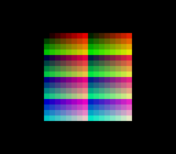

# direct_color — the pixel byte IS the color



Effects arc 4/7. Direct color mode (CGWSEL bit 0, exposed as
`colorMathSetDirectColor()`) makes the PPU read 8bpp BG pixels as
**BBGGGRRR colors directly**, bypassing CGRAM entirely. This example
builds a 16×16 chart of all 256 pixel codes procedurally — zero
assets, 256 solid-color tiles generated in C at init — and loads a
deliberately different CGRAM palette (a grayscale ramp), so **A**
flips the very same VRAM bytes between two readings: the BBGGGRRR
color cube (direct, boot state) and the grayscale ramp (CGRAM).
Nothing is re-uploaded on toggle — one register bit changes the
meaning of every pixel on screen.

ROM mode: LoROM (project default).

## SNES Concepts

- Direct color (CGWSEL bit 0): 8bpp pixel value → 15-bit BGR by field
  expansion (B: 2 bits, G: 3, R: 3); tilemap palette bits become one
  extra low bit per channel (2048 colors max, no CGRAM cost)
- Applies to 8bpp layers only (BG1 in modes 3/4, Mode 7) — 2/4bpp
  layers and sprites keep their CGRAM palettes untouched
- Mode 3 and the 8bpp planar tile format (4 interleaved bitplane
  pairs, 64 bytes/tile), built byte by byte in C
- The colormath module's CGWSEL shadow: the setter composes with any
  blending configuration

## How to Build

```bash
make
```

## Modules Used

console, dma, background, colormath, input
