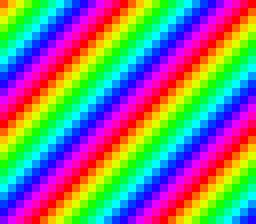

# palette_cycle — animate by rotating CGRAM

**Family 6 (Colour & effects) · rung 6b — palette cycling.**

## Why it matters for your game

Flowing water, bubbling lava, crackling fire, a shimmering "loading"
bar, chasing marquee lights — the SNES draws all of these without
redrawing a single pixel or spending any VRAM bandwidth. You rotate a
handful of palette entries and the hardware does the rest. It is the
cheapest animation on the machine, and once you see it you will spot it
in half the games you grew up with.



## What you'll learn

The single new idea: **CGRAM is a live lookup table.** Rewrite one
colour entry during VBlank and every pixel that indexes it changes
colour on the very next frame — no tiles touched, no map redrawn. This
rung rests on what you already know: solid tiles, a tilemap, and
`dmaCopyCGram()` from earlier colour rungs.

The scene is built procedurally (zero assets): 16 solid 4bpp tiles —
tile *i* is a flat fill of palette index *i* — and a tilemap laid out as
`tile = (row + col) & 15` so the colour index runs along each diagonal.
A 16-colour rainbow is generated at init and kept as a RAM master copy;
every fourth frame it is rotated by one slot and pushed back to CGRAM.
Because the rainbow closes the loop (entry 15 flows into entry 0), the
cycle is seamless.

## What to observe / if it breaks

- **Correct run:** diagonal rainbow bands drift steadily up-and-left.
  Press **START** to freeze the cycle — the bands stop dead, proving the
  picture itself never moved; press again to resume.
- **Bands drift but look chunky/stepped:** expected — palette cycling
  steps one entry at a time; the `(row + col)` diagonal and the smooth
  rainbow are what make it read as flow.
- **Colours flicker or garble instead of cycling:** the CGRAM reload ran
  outside VBlank. The rotation must happen after `WaitForVBlank()` — the
  CGRAM port is silently ignored during active display.
- **Static rainbow, no motion at all:** the frame counter never reaches
  its threshold, or `cycling` got stuck at 0 — check the toggle.

Probe oracle: `cycle_pos` counts every rotation (advances while running,
frozen after a START toggle); `cycling` is the on/off flag.

## Build & run

```bash
make
../../../tools/luna-test/bin/luna run -n 3000000 palette_cycle.sfc
```

## Modules used

`console`, `dma`, `background`, `input`

## Where you are

← previous: [transparency](../transparency/) · colour math blending
· → next in family: [direct_color](../direct_color/) · the pixel byte *is* the colour
