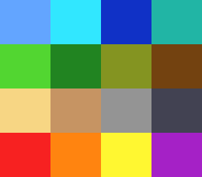

# shadow_tint — recolour a whole scene at once

**Family 6 (Colour & effects) · rung 6c.2 — shadow & tint.**

## Why it matters for your game

Mood is colour. Nightfall, a dungeon, a cave — subtract a grey and the
whole screen darkens. Underwater, poison gas, a lava cavern, a sepia
flashback, the red flash of taking a hit — add a colour and everything
takes that cast. The SNES does this to every pixel of a layer in one PPU
pass, so a single register pair changes the entire scene's atmosphere for
zero per-frame cost. It is the difference between one tileset and a
tileset that reads as day, dusk, and midnight.



## What you'll learn

The single new idea: **colour math against a *fixed* colour.** The PPU
takes the finished main-screen image and adds or subtracts a constant
colour per layer — `colorMathShadow()` subtracts a grey (darken),
`colorMathTint()` adds a colour (cast). This rests on the layers, tiles
and palette you already know; the effect sits *on top* of them and
touches no VRAM, CGRAM or OAM.

Because both effects share the one fixed-colour register and the single
add/subtract bit, **only one is active at a time** — which is exactly why
the demo cycles through them rather than combining them. The scene is a
4×4 chart of sixteen game-world colours, built procedurally (zero
assets), so you can watch the transform land on every hue together.

## What to observe / if it breaks

- **Correct run:** the plain colour chart. Press **A** to cycle:
  `none → shadow (darkens) → underwater (blue cast) → sunset (warm cast)
  → none`. Every swatch shifts together each press.
- **Nothing changes when you press A:** colour math applies only to layers
  you enabled *and* that are on the main screen — check
  `setMainScreen(LAYER_BG1)` and that the effect targets `COLORMATH_BG1`.
- **Only part of the screen is affected:** the colour-math *condition* is
  windowed. This example leaves it at `COLORMATH_ALWAYS`; a stray
  `colorMathSetCondition()` would clip it to a window region.
- **Shadow goes fully black / tint blows out white:** the fixed-colour
  intensity is too high — `colorMathShadow` subtracts, `colorMathTint`
  adds, both clamp at the channel limits.

Probe oracle: `fx_state` (0 none, 1 shadow, 2 underwater, 3 sunset)
advances on each A press; the effect matches CGADSUB (add/subtract) and
COLDATA (the fixed colour).

## Build & run

```bash
make
../../../tools/luna-test/bin/luna run -n 3000000 shadow_tint.sfc
```

## Modules used

`console`, `dma`, `background`, `colormath`, `input`

## Where you are

← previous: [transparency](../transparency/) · colour math between two layers
· → next in family: [direct_color](../direct_color/) · the pixel byte *is* the colour
