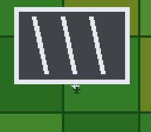

# mode7_flying — a Pilotwings-style demo



A plane over a Mode 7 landscape (#4, part 2). The core trick:
**altitude drives the Mode 7 scale** — climbing zooms the terrain out,
diving zooms in — and a shadow sprite slides away from the plane as
you climb: the two classic SNES depth cues, from two register writes
per frame.

| Input | Action |
|---|---|
| D-pad left/right | turn |
| Up / Down | climb / dive |
| A / B | throttle up / down |

Objective: land on the three striped pads (slow and low over a pad —
green flash). Water is a splash (respawn); touching fields too fast
bounces you back up. The terrain (patchwork fields, river and lake,
three helipads) is generated at build time by `gen_terrain.py`
(committed, deterministic).

ROM mode: LoROM (project default).

## SNES Concepts

- Altitude as Mode 7 scale: `mode7SetScale(0x0100 + alt)` then
  `SetAngle` (the scale feeds the matrix at SetAngle time)
- The shadow depth cue: the same procedural sprite shape with a dark
  palette, screen offset proportional to altitude
- A takeoff/landing state machine: the landing EVENT fires only on
  the airborne→ground transition, so taxiing and takeoff work
- Banked-data ASM accessor for the 16 KB class map (B2 escape, the
  mode7_racing pattern)

## How to Build

```bash
make
```

## Modules Used

console, dma, background, sprite, math, mode7, input
