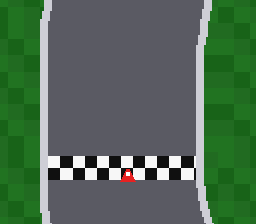

# mode7_racing — an F-Zero-style mini game



A drivable race circuit on the Mode 7 plane (#4, part 1). The car
stays fixed low on screen and the **world** rotates and scrolls under
it — the classic SNES racing camera, driven per frame by the
C-migrated mode7 module (`mode7SetAngle` + `SetCenter` + `SetScroll`).

| Input | Action |
|---|---|
| D-pad left/right | steer |
| A | accelerate |
| B | brake |

Grass slows the car to a crawl; the red border wall is solid. The
track (rounded rectangle + chicane, checker start line) is generated
at build time by `gen_track.py` (committed, deterministic) and
converted with `gfx4snes -M 7`.

ROM mode: LoROM (project default).

## SNES Concepts

- The F-Zero camera: `mode7SetCenter(car)` pivots rotation on the
  car, `SetScroll` places it low on screen, `SetAngle(heading)` spins
  the world — heading shares the math module's 0-255 angle unit, so
  it feeds `fixSin`/`fixCos` (velocity) and the PPU matrix directly
- Fixed-point driving physics: 12.4 positions, 8.8 speeds,
  surface-dependent speed caps
- **Banked-data access (B2)**: the 16 KB collision class map lives
  outside bank $00, where C pointer derefs cannot reach (they are
  bank-$00-hardcoded) — a one-instruction ASM accessor
  (`lda.l track_class,x`) does it right, and the hardened
  `check_bank_reads` guard fails any build that tries from C
- Mode 7 VRAM interleave (`dmaCopyVramMode7`) + OBJ tiles at name
  base 3; a procedural 4bpp car sprite built in C

## How to Build

```bash
make
```

(Regenerate the track: `python3 gen_track.py`, then `make`.)

## Modules Used

console, dma, background, sprite, math, mode7, input
