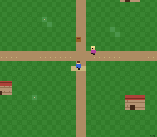

# rpg — an RPG template driven by a Tiled map



The SDK's modules composed into a playable RPG skeleton. Two things
make it a *template* rather than a demo:

**1. The map is a real Tiled map.** `res/town.tmj` holds the terrain,
the per-tile collision (each tile's `attribute` property) and the
entity positions (the `Entities` object layer: spawn, villager,
chest). None of it is hardcoded — open the map in
[Tiled](https://www.mapeditor.org/), edit it, re-run the generator,
rebuild. The map is validated by the SDK's own `tmx2snes` converter.

**2. A real bordered dialog box.** A 9-slice panel on BG2 with the
text on BG3 above it — the classic SNES RPG window, with the layers
stacking town < box < text.

| Input | Action |
|---|---|
| D-pad | walk (one tile per step) |
| A | talk to the villager (face it) / open the chest (step on it) |

ROM mode: LoROM (project default).

## SNES Concepts

- **Tiled as the content pipeline**: collision and entities are data.
  `gen_assets.py` reads `town.tmj` and emits the SNES tilemap, a
  64×64 collision map and `entities.inc`.
- **Tile-exact collision**: the hero *occupies one tile*; its 16×16
  sprite is drawn straddling that tile (feet on it, body overhanging
  upward) — the standard top-down convention. Drawing the sprite at
  the tile corner instead puts the visible body half a tile from what
  collides, which reads as random "too early / too late" blocking.
- **Two characters, one sprite sheet**: the villager reuses the hero's
  tiles with a second OBJ palette (CGRAM 144) — recolored, not
  redrawn.
- **A 9-slice dialog box** DMA'd to BG2 on open, with `text_config.priority`
  and BGMODE bit 3 putting the text in front of the opaque town.
- **Collision through the SDK's `collideTile()`** over the Tiled map. Its
  `tilemap` parameter is `const`, so the lookup is a bank-honouring far
  read (#121) — the 4 KB map needs neither bank $00 nor a byte of RAM.

## Editing the map

```bash
# open res/town.tmj in Tiled, edit terrain / drag the Entities objects
python3 gen_assets.py --keep-map    # re-read the .tmj, rebuild binaries
make
```

Tile collision is the `attribute` property on each tileset tile
(`FF00` = solid, `0` = walkable). Entities are objects in the
`Entities` layer, typed `spawn`, `npc` or `chest`. An `npc` blocks its
tile (you talk face-to-face); a `chest` does not (you step onto it).

Run `python3 gen_assets.py` without `--keep-map` to regenerate the
whole map from the script's layout.

`town.tmj` is a standard Tiled map, so the SDK's own converter reads it
too — a useful check that the file is well-formed:

```bash
../../../bin/tmx2snes res/town.tmj res/tileset.map   # writes .m16/.b16/.o16/.t16
```

This example doesn't *use* that output: it scrolls a 64×64 map with the
`background` module, which wants a quadrant-ordered tilemap, whereas
`tmx2snes` emits the `.m16` streaming format the `map` module consumes
(see `examples/maps/tiled`). `gen_assets.py` therefore does its own
conversion from the same `.tmj`.

> Generating the `.tmj` from a script has one trap: `cute_tiled` (the
> parser inside `tmx2snes`) rejects pretty-printed JSON with a bare
> `Invalid integer`. Write it compact and key-sorted —
> `json.dumps(tmj, sort_keys=True, separators=(",", ":"))`.

## How to Build

```bash
make
```

## Modules Used

console, dma, background, sprite, text, input
