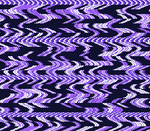

# HDMA Wave Table



Builds a raw HDMA table by hand in C and animates it krom-style: the table is
written once, and each VBlank only the table **start pointer** advances by one
entry — the ripple pattern flows up the screen without rewriting a single
table byte. This is the classic per-scanline effect plain DMA cannot do: a different
BG1 horizontal scroll value on every line.

C port of "SNES Wave HDMA Demo" by krom (Peter Lemon),
[github.com/PeterLemon/SNES](https://github.com/PeterLemon/SNES)
(`PPU/HDMA/WaveHDMA`) — the technique reproduced on the `snes/hdma.h` API.
All art is original (procedural — this example ships zero binary assets):
LCG-seeded aperiodic streak tiles, chosen deliberately because periodic art
(fixed-width stripes) makes a per-scanline displacement ambiguous modulo the
stripe width — to the eye and to any screenshot-based measurement.

**Measured parity with the original** (both ROMs captured with `luna frames`,
same displacement-field analysis): wave period 25 vs 26 scanlines, amplitude
peak-to-peak 19.5 vs 20.0 px (±10), speed ~1 scanline/frame both, direction
identical (ripples flow up). krom's period is not an integer (his samples
drift each cycle), hence 26 — the closest integer period.

The companion example [`hdma_wave`](../hdma_wave) shows the same visual through
the library's high-level engine (`hdmaWaveH` / `hdmaWaveUpdate`); this one is
the low-level counterpart that teaches the HDMA **table format** itself.

## SNES Concepts

- HDMA table format: `count` byte + register payload per entry, `0x00` terminator
- `HDMA_MODE_1REG_2X`: one register written twice per line — the shape the
  16-bit scroll registers (`$210D` BG1HOFS low/high) expect
- Animation by start-pointer repoint (`hdmaSetup(..., table + phase*3)` once per
  frame): the table is immutable, so HDMA never sees a partial entry — no
  tearing, near-zero CPU cost
- The 224+period entry layout: from any start phase there are always ≥224 valid
  entries ahead (krom's 224+672 trick — our integer 26-line period wraps in 26)
- Procedural 4bpp tile generation in C (planar format) and row-buffer tilemap
  upload

## How to Build

```bash
make
```

## Modules Used

console, dma, background, hdma
