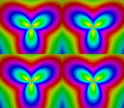

# "3840 colors" — RGB channel-split blend

Port of krom (Peter Lemon)'s **HiColor3840**
([PeterLemon/SNES](https://github.com/PeterLemon/SNES), `PPU/Blend/HiColor/HiColor3840`).
The image's green+blue channels live on BG1 (Mode 3, 240 colors at CGRAM
16-255); the red channel lives on BG2 (16-level 4bpp ramp at CGRAM 0-15);
color math ADDs them per pixel — 240 × 16 = "3840 colors", static, no
HDMA, no IRQ. Original trefoil-wheel art (`gen_assets.py`, outputs
committed).

**Measured proof — the corpus's first colormath dogfood**: the captured
frame is **bit-exact (0/57344 pixels differ)** against a mathematical
model of SNES color addition (`min(GB+R, 31)` per 5-bit channel) applied
to the committed tile+palette data. `colorMathSetSource(SUBSCREEN)` +
`SetOp(ADD)` + `SetHalf(0)` + `Enable(BG1|BACKDROP)` reproduce krom's
CGWSEL $02 / CGADSUB $21 exactly.

## Modules Used
`console`, `dma`, `background`, `colormath`
