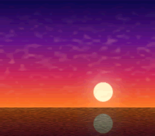

# HiColor × pseudo-hires — 1792 palette slots at 512 pixels

Port of krom (Peter Lemon)'s **HiColor64PerTileRowPseudoHiRes**
([PeterLemon/SNES](https://github.com/PeterLemon/SNES), `PPU/HDMA/HiColor64PerTileRowPseudoHiRes`)
— the integration of the two surfaces the effects arc landed separately:
`hicolor_1792`'s per-scanline H-IRQ CGRAM stream runs UNDER
`videoSetPseudoHires(1)`. The 512×224 sunset (original art, aspect-corrected
for half-width pixels) is split by column parity — odd columns on BG1
(main), even on BG2 (sub) — and the PPU re-interleaves them while the
64-color row palettes reload per scanline. Color math (ADD-half of the
subscreen into BG1+backdrop, krom's CGWSEL $02 / CGADSUB $61) softens
column fringing.

## Register fidelity vs the original

| Register | krom | this port |
|---|---|---|
| BGMODE | `$09` (Mode 1, priority) | same (`setMode(BG_MODE1, 0x08)`) |
| SETINI | `$08` (pseudo-hires) | same (`videoSetPseudoHires(1)`) |
| TM / TS | BG1 / BG2 | same |
| CGWSEL / CGADSUB | `$02` / `$61` | same (`colorMathSetSource/Op/Half/Enable`) |
| VRAM | BG1 $0000w, BG2 $4000w, shared map $3C00w+row4, VOFS 31 | same |
| IRQ stream | HTIME 190, 16 B/line, VBlank rewind | `hicolor_1792`'s handler, verbatim |

Converter: `devtools/hicolor64hires.py` (krom's SNESBGPAL64tilerowHiRes.py
contract — outputs committed).

## Modules Used
`console`, `dma`, `background`, `colormath`
