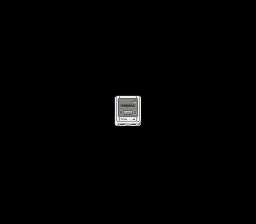

# Drive a sprite with the pad

**Family 4 — Input · rung 4.2**

The rung that turns a demo into a game: read the D-pad every frame and move a
sprite with it. This is the difference between *watching* and *playing* — the
player is now in control.



## What you'll learn

- `padHeld(0)` returns a 16-bit bitmask of the buttons held this frame. The
  NMI reads the pad automatically every VBlank; you just read the result.
- Test the D-pad bits (`KEY_UP` / `KEY_DOWN` / `KEY_LEFT` / `KEY_RIGHT`) and
  nudge the sprite's position each frame.
- `oamSetXY(id, x, y)` updates **only** a sprite's position, leaving its tile
  and size untouched — the per-frame call you want inside a game loop (vs.
  `oamSet`, which rewrites the whole entry).

## SNES concepts

This reuses the entire `simple_sprite` setup — tiles to VRAM, palette to CGRAM
128, OBJSEL — and adds a single new thing: the input loop. Sprite position is
9-bit X and 8-bit Y, so if you walk off an edge the coordinate wraps around.
That OAM coordinate quirk is visible here for free; real games park an
off-screen sprite at a hidden Y instead of letting it wrap.

## How to build

```bash
make -C examples/input/move_sprite
```

Run `move_sprite.sfc` in [luna](https://github.com/k0b3n4irb/luna) and steer
the sprite with the D-pad.

## Modules used

`console`, `dma`, `sprite`, `input`

## Ladder

← 4.1 [`controller`](../controller/) · → 4.3 [`two_players`](../two_players/)
