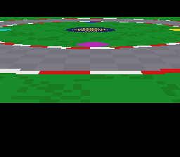

# Mode 7 rotating perspective — the full matrix, per scanline



Port of krom (Peter Lemon)'s **Mode7 Perspective** demo
([PeterLemon/SNES](https://github.com/PeterLemon/SNES), `PPU/Mode7/Perspective`).
Four HDMA channels each stream one Mode 7 matrix register per scanline —
M7A and M7D from a cosine table, M7B from sine, M7C from -sine — so the
ground plane is simultaneously **perspective-projected** (each line scaled
by `20480/y`, an 80× zoom-out at the horizon shrinking hyperbolically to
0.36× up close) and **rotated** (48 steps of 7.5°). The sibling example
`mode7/perspective` drives only the diagonal terms
(no rotation); this one exercises the full affine matrix.

The tables are krom's exact bytes (`res/m7{cos,sin,nsin}.bin`, extracted
verbatim), their math reverse-engineered and verified:
`entry(a,y) = trig(2πa/48)·20480/y` in 8.8 fixed point — 32256/32256
entries proven by `devtools/m7ptables.py verify`. The track art is
original (9 prefab tiles composed into a 128×128 Mode 7 world).

## Controls (krom's map)

- **D-pad** — move over the plane (scroll + pivot together)
- **L / R** — rotate the world in 7.5° steps
- **Y / A** — nudge the pivot on X · **X / B** — nudge it on Y

## SNES Concepts

- Per-scanline Mode 7 matrix writes (perspective + rotation combined)
- 4-channel HDMA coordination (`hdmaSetup` ×4 + `hdmaEnable(0x0F)`)
- HDMA table repointing as a zero-copy animation primitive
- Mode 7 interleaved VRAM (`dmaCopyVramMode7`); out-of-map backdrop (M7SEL=$80)
- VBlank-window discipline: repoint right after `WaitForVBlank()` — re-arming
  an HDMA channel mid-frame restarts its table walk

## Register fidelity vs the original

| Register | krom | this port |
|---|---|---|
| BGMODE | `$07` | same (`setMode(BG_MODE7, 0)`) |
| M7SEL | `$80` | same (`mode7SetSettings`) |
| DMAP0-3 / BBAD0-3 | `%010` / $1B,$1C,$1D,$1E | same (`hdmaSetup` ch 0-3) |
| A1B0-3 | banks 1,2,3,1 | from the far pointers (SUPERFREE sections) |
| HDMAEN | `%00001111` | same (`hdmaEnable(0x0F)`) |
| BG1HOFS/VOFS, M7X/M7Y | 384/768, 512/1152 | same pose, same per-frame sync order |
| Table repoint | A1Tx rewrite after WaitNMI | `hdmaSetup` ×4 after `WaitForVBlank()` |

## Measured parity (luna v1.9.0)

- Tables: **byte-identical** to the reference (extracted verbatim, math
  verified 32256/32256).
- In-bounds projection: point-samples of the rendered frame match the
  world image through the documented matrix model (same check passes on
  the reference against its own art).
- **Rotation parity, the strong number**: at +90° (12 L-presses) both
  ROMs show the same out-of-map black except one green wedge —
  **590 non-black pixels in both, IoU = 1.0000** (pixel-exact geometry);
  at 180° both are fully black. The "rotate into the void" behavior is
  the reference's own (pivot outside the 1024² world, M7SEL=$80 backdrop).

## Two integration lessons this port surfaced

1. `hdmaSetup()` configures but does **not** enable — `hdmaEnable(mask)`
   is a separate call (the un-enabled state renders a convincing static
   1:1 view that LOOKS like a broken perspective; check `dma.hdmaen`).
2. Calling `hdmaSetup` from an `nmiSet` callback did not take effect
   (registers unchanged) while the same call works from the main loop —
   under investigation as a potential NMI-context/ABI interaction; the
   main-loop placement right after `WaitForVBlank()` is krom's own
   pattern and still inside VBlank.

## How to Build

```bash
cd examples/mode7/perspective_rotate && make
```

## Modules Used

`console`, `dma`, `background`, `hdma`, `input`, `mode7`
