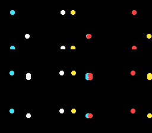

# sprite_swarm — a bouncing swarm, and the OAM throughput ceiling

**Family 3 (Sprites) · rung 3.7 — the showcase, and an honest one.**

## Why it matters for your game

Bullets, particles, a shower of coins, a flock of enemies — games throw a
lot of sprites at the screen. This rung answers *how many can you actually
move at 60 fps*, and the answer is more nuanced than "128, it's hardware":
the sprites are free, but **touching each one from C every frame is not**.
Knowing where that line sits — and how to cross it — is what lets you
budget a busy scene instead of discovering the slowdown after you've built
it.



## What you'll learn

The single idea: **the per-sprite update budget.** The SNES has 128
hardware sprites and moves them with one OAM DMA per frame — cheap. But
computing and writing each sprite's position in C is not free: the OAM
buffer lives in bank $7E (every write is a slow long address) and cc65816
spills registers in a busy loop. Measured on luna, the smooth-60 fps
ceiling for per-sprite C motion is **~32 sprites**; 40 already drops to 30.

So this swarm runs 32 dots at a rock-steady 60 fps, each bouncing
independently. The motion is deliberately trivial (integer add + edge
bounce — no multiply, no trig) so what you're seeing is the cost of the
*OAM update itself*, not the maths. Positions are written straight into
`oamMemory[]`; a single `oam_update_flag` lets the NMI's DMA push them all.

**To go past the ceiling** you move the work off the main CPU or out of C:
[chips/sa1_starfield](../../chips/sa1_starfield/) runs 128 birds of
Lissajous *trig* on the SA-1 at 10.74 MHz; a hand-written assembly update
loop is the other route. Same 128-sprite hardware, a bigger compute budget.

## What to observe / if it breaks

- **Correct run:** 32 red/cyan/yellow/white dots bounce around at a smooth
  60 fps, reversing at the edges.
- **It stutters / runs slow:** you raised `NBIRDS` past the C budget — each
  extra sprite is more bank-$7E writes and loop overhead. Profile before
  assuming the hardware is the limit; it usually isn't.
- **Dots blink out where they pile up:** the per-scanline sprite limit (32
  sprites / 34 8×8 tiles per line). Real hardware — spread them or accept it.
- **Nothing visible:** sprites need `setMainScreen(LAYER_OBJ)` and colour 1
  of an OBJ palette (CGRAM 128+) set to something non-black.

Probe oracle: `swarm_frame` advances once per displayed frame.

## Build & run

```bash
make
../../../tools/luna-test/bin/luna run -n 3000000 sprite_swarm.sfc
```

## Modules used

`console`, `dma`, `background`, `sprite`

## Where you are

← previous: [dynamic_metasprite](../dynamic_metasprite/) · streaming a multi-tile character
· the family caps here — for 128 sprites of heavy math, see
[chips/sa1_starfield](../../chips/sa1_starfield/)
