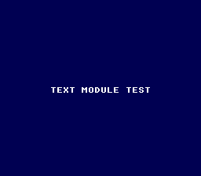

# Print a string

**Family 1 — Text · rung 1.1 (the built-in font)**

The gentlest program that still exercises the whole SNES rhythm — tiles,
palette, VRAM and the VBlank handshake — on the smallest possible surface.
It prints one string in white on a dark blue screen and idles. If text ever
breaks, this is the simplest ROM that reveals it.



## What you'll learn

- The OpenSNES text module in one call: `textModeInit()` configures the
  hardware *and* the text engine, then `textPrintAt(col, row, "…")` writes to
  an off-screen buffer.
- The NMI handler DMAs that buffer to VRAM as a tilemap on the next VBlank —
  **no manual `textFlush()` needed** on this path.
- Colour 0 is the universal backdrop; `setColor(0, RGB(r,g,b))` sets it.
- `setScreenOn()` is called **last**, after a `WaitForVBlank()`, so all VRAM
  writes land during blanking (no garbage first frame).

## SNES concepts

The SNES has no text hardware. Characters are background tiles: a font lives
in VRAM as tiles, and a tilemap maps each screen cell to a tile index. The
`text` module owns both — you just call `textPrintAt`. Mode 0 is used because
the built-in font is 2bpp (4 colours), which is all monochrome text needs.

## How to build

```bash
make -C examples/text/print_string
```

Then run `print_string.sfc` in [luna](https://github.com/k0b3n4irb/luna) (or
any SNES emulator). You should see **TEXT MODULE TEST** in white on dark blue.

## Modules used

`console`, `dma`, `text`, `background`, `sprite`

## Next rung

→ **1.2 Load a custom font from a PNG** · under the hood: how a glyph is 2bpp
bitplanes + a tilemap → [`fundamentals/text_glyphs`](../../fundamentals/text_glyphs/).
