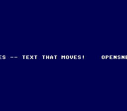

# Scroll a message

**Family 1 — Text · rung 1.4 (move text)**

The "make it move" rung of the Text ladder. It prints one line, then scrolls
the whole text background horizontally every frame, so the message marches
across the screen like a marquee and wraps around seamlessly — without ever
rewriting the tilemap.



## What you'll learn

- Text lives on a **background layer**, so you move it exactly like any other
  BG — with `bgSetScroll(0, x, 0)` on BG1 (the text layer).
- Scroll writes are **buffered**: `bgSetScroll()` stores a value and marks it
  dirty; the NMI handler pushes it to the PPU during VBlank, so the scroll
  never tears.
- A 32×32 tilemap is exactly one screen wide (256 px), so incrementing the
  horizontal offset wraps the message around — a continuous marquee for free.

## SNES concepts

The PPU has hardware scroll registers per background. You never redraw the
tilemap to move text — you change where the PPU starts reading it. Increasing
BG1's horizontal offset scrolls the view right, so the content appears to
travel left. Because the tilemap width equals the screen width, the wrap is
seamless and costs nothing per frame beyond a single register update.

## How to build

```bash
make -C examples/text/scroll_message
```

Run `scroll_message.sfc` in [luna](https://github.com/k0b3n4irb/luna). You
should see **OPENSNES -- TEXT THAT MOVES!** scrolling right-to-left forever.

## Modules used

`console`, `dma`, `text`, `background`, `sprite`

## Ladder

← 1.1 [`print_string`](../print_string/) · → 1.5 text effects (typewriter,
wave, fade, colour-cycle)
