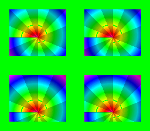

# Multi-window HDMA — both windows animated per scanline



Port of krom (Peter Lemon)'s **WindowMultiHDMA** demo
([PeterLemon/SNES](https://github.com/PeterLemon/SNES), `PPU/Window/WindowMultiHDMA`).
One HDMA channel in **4-register mode** streams WH0-WH3 ($2126-$2129) —
both windows' left AND right edges — per scanline band, cutting a 2×2
grid of portholes into BG1. The green backdrop shows wherever the
combined mask disables the layer; the D-pad scrolls the ring artwork
behind the fixed portholes. `hdmaWindowShape` covers a single window;
this is the two-window composition the arc audit flagged.

Window algebra (krom's exact setup): W1 and W2 both enabled on BG1 and
both inverted, combined with AND — masked where (outside W1) AND
(outside W2) = visible inside either window.

The table is krom's exact 14-band data (in `main.c`); the artwork is
original (procedural radial color wheel, tiled 2×2 so gfx4snes dedups
it into 16 KB of tiles).

## SNES Concepts

- `HDMA_MODE_4REG`: one channel drives 4 consecutive PPU registers/line
- Two windows shaped per scanline (W1L/W1R/W2L/W2R in one stream)
- Window combination logic: `windowSetInvert` ×2 + `windowSetLogic(AND)`
  + `windowSetMainMask` — the full W12SEL/WBGLOG/TMW surface from C
- Degenerate window (left=1, right=0) as the "fully masked" band value

## Register fidelity vs the original

| Register | krom | this port |
|---|---|---|
| BGMODE | `$0B` (Mode 3, priority) | same (`setMode(BG_MODE3, 0x08)`) |
| W12SEL | `$0F` (W1+W2 on BG1, inverted) | same (windowEnable+windowSetInvert ×2) |
| WBGLOG | `$01` (BG1 = AND) | same (`windowSetLogic(WINDOW_BG1, WINDOW_LOGIC_AND)`) |
| TMW | `$01` | same (`windowSetMainMask(WINDOW_BG1)`) |
| DMAP0/BBAD0 | `%100` / `$26` | same (`hdmaSetup(ch0, HDMA_MODE_4REG, HDMA_DEST_WH0, …)`) |
| HDMA table | 14 bands of 16 lines | krom's exact bytes (see main.c) |
| Backdrop | green (CGRAM 0) | same (`setColor(0, RGB(0,31,0))`) |

## How to Build

```bash
cd examples/windows/window_multi_hdma && make
```

## Modules Used

`console`, `dma`, `background`, `hdma`, `window`, `input`
